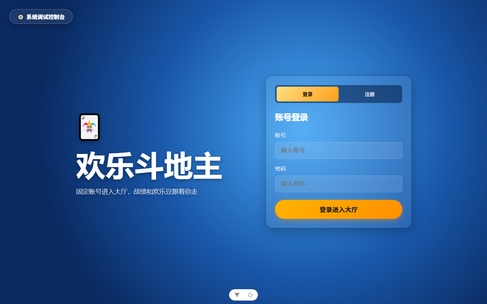
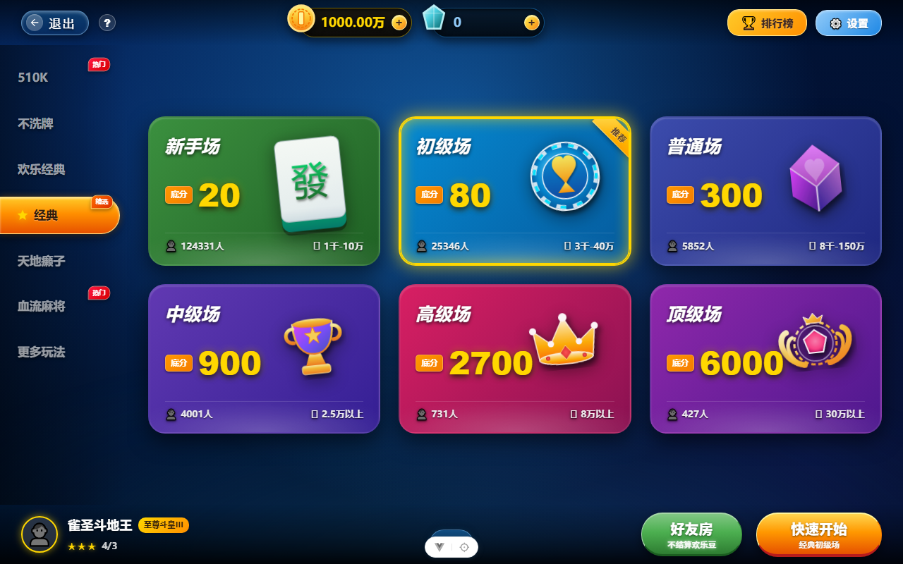
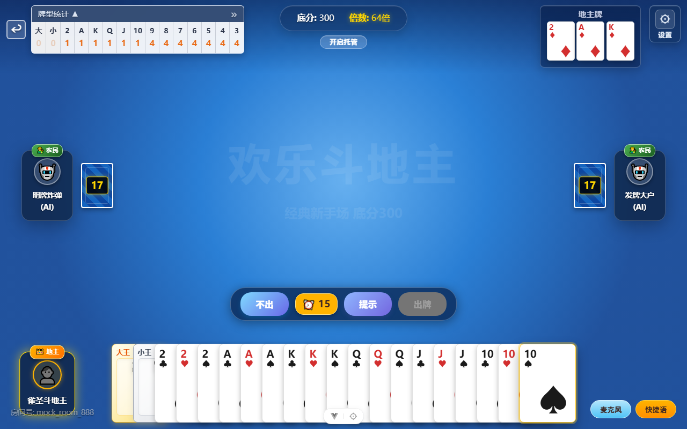
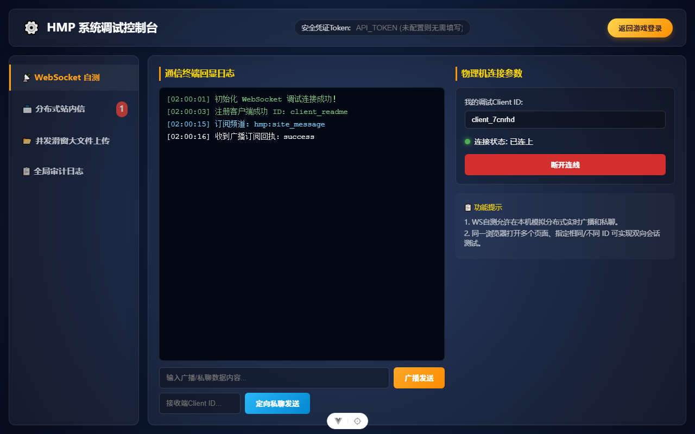
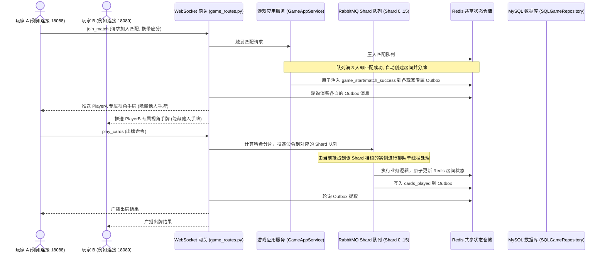

# 🃏 happy_doudizhu — 欢乐斗地主网络对战系统

本项目是一个采用前后端彻底分离架构的“欢乐斗地主”网络对战系统。系统以 **FastAPI + Vue 3** 为核心，搭配 **Redis** 存储匹配队列与对局状态，以及 **MySQL** 落地存储战绩与玩家档案。系统内置了强健的掉线重连机制与自研扑克牌规则引擎，并提供独立的 AI 降级接管机器人，实现了极佳的可玩性与开发调试体验。

> 📢 **致开发者与智能体 (AGENTS)**：
> 本项目任何功能优化与新功能实现，均必须在完成开发后，将对应的新特性、接口变更或配置说明同步更新并写入本 `README.md` 文档中，保持文档与代码功能同步演进。

---

## 🎨 游戏界面巡礼 (Screenshot Tour)

### 1. 账号登录与注册页
玩家通过唯一的账号或昵称快捷注册与登录，进入持久化游戏大厅，所有的欢乐豆和段位战绩将绑定账号，终局持久化。


### 2. 多人游戏大厅
支持底分不同的六大段位场次选择；集成全局欢乐豆富豪排行榜；界面采用流畅的玻璃态毛玻璃视觉设计。


### 3. 实时对局房间
支持逼真的实时叫地主、抢地主、加倍与出牌交互。游戏界面包含精细的头像标识、手牌排列、上家出牌反馈、剩牌提示以及气泡短语聊天。


### 4. 调试控制台与 Mock 模式
为开发与运维人员量言打造的控制台。支持 WebSocket 文本消息调试、广播站内信发送与接收、大文件并发分片上传进度条展示以及系统审计日志的高级筛选与气泡预览。
```text
体验开发 Mock 模式：
如果在前端开发环境下，在 URL 后面附带 `?mock=true` 参数，例如：
http://localhost:5173/lobby?mock=true 
即可在无需启动后端的情况下直接体验和预览完整的前端交互界面！
```


---

## ✨ 核心功能特性 (Key Features)

* **🧩 DDD 领域驱动设计实践**：后端严格隔离业务核心与基础设施实现。领域层定义扑克牌编码、洗牌发牌、牌型校验与压制算法以及五大状态的游戏房间状态机。
* **🃏 不洗牌模式算法与基础设施支持**：
  - **领域层算法**：实现切牌（`cut_cards`）保留局部牌序、基于自定义/已回收牌堆的发牌分发（`deal_with_deck`）以及带有完整性校验的残局回收重组（`recycle_cards`）算法。
  - **Redis 仓储适配**：物理隔离不洗牌匹配队列键名（`game:match_queue:no_shuffle:{base_score}`），并实现全局不洗牌历史牌池（`game:noshuffle:deck_pool`）读写，支持基于 LTRIM 的最新 100 叠牌自动剪裁，防止内存膨胀。
* **⚡ WebSocket 实时对战网关**：基于双向长连接，实时进行叫地主、出牌、过牌等交互。采用玩家专属个人视角的防作弊手牌广播机制，确保数据公平。
* **🌐 分布式高可用与可靠异步结算**：
  - **分片队列路由 (Shard Routing)**：所有房间的出牌命令，基于房间 ID 的哈希值，被均匀分摊路由至 16 个 RabbitMQ 分片队列中，确保同一个房间的全部指令严格按序执行，规避并发写冲突。
  - **Redis 租约灾备管理 (Lease Failover)**：每个分片队列的所有权由各网关进程通过 Redis 10秒短租约锁（Lua 原子脚本心跳）进行抢占。当某一网关实例宕机时，其余存活实例会在 10-15 秒内自动接管其负责的分片消费，确保服务高可用。
  - **MQ 可靠异步结算**：游戏结束时的数据库结算操作完全解耦，转换为持久化任务推送至 RabbitMQ 异步任务信道 `ddz.game.settlement`，由独立的 Settlement Worker 在事务提交后原子清理 Redis，实现结算流的强一致性与幂等。
  - **开局 Outbox 中转**：跨网关实例匹配开局时，玩家各自视角的 `game_start` 事件被原子注入 Redis Outbox，由各在线实例的网关 Relay 读取推送，实现跨端口无缝收牌。
* **🤖 托管 AI 决策与双层兜底**：匹配超时自动机器人常驻补位，对局中玩家离线自动托管。结合 DouZero 强化学习 AI 模型与 Rule-based 规则兜底 AI，确保出牌合理且不中断。
* **🏆 36级特色排位头衔系统**：涵盖从`包身工`到`至尊`的趣味称号，按对局胜负、炸弹数量、春天等触发原子星数变动。支持低段位新手保护与高段位硬核无保护博弈。
* **🎵 自研 Web Audio 音频引擎**：支持背景音乐的无缝切换，以及出牌、加倍、叫分等动作音效的异步解码与低延迟播放。
* **🛡️ 安全大文件切片上传**：调试控制台支持大文件的 WebSocket 并发分片上传，内置文件名净化、路径穿越防护与分片切片边界校验。
* **📝 完整的审计日志追踪**：对系统核心数据如欢乐豆增减、段位变更和敏感上传进行严密的审计记录，支持防抖异步写入。

---

## 📂 项目目录结构树

```text
happy_doudizhu/
├── backend/                        # 后端项目根目录 (FastAPI + SQLAlchemy)
│   ├── alembic/                    # 数据库迁移脚本及历史版本
│   │   └── versions/               # 具体迁移版本脚本文件
│   ├── app/
│   │   ├── domain/                 # 领域层：纯业务逻辑与核心规则 (无技术细节依赖)
│   │   │   ├── game/               # 游戏核心逻辑
│   │   │   │   ├── card.py         # 扑克牌编码、排序与洗牌发牌规则
│   │   │   │   ├── card_type.py    # 14种牌型智能判定与压制(can_beat)算法
│   │   │   │   └── room.py         # 游戏房间状态机 (五大生命周期阶段流转控制)
│   │   │   └── audit_log/          # 审计日志领域对象及仓储契约
│   │   ├── application/            # 应用层：业务流程编排与用例驱动 (协调指挥官)
│   │   │   ├── game/
│   │   │   │   └── game_app_service.py # 玩家匹配、开局、出牌流程及托管 AI 决策编排
│   │   │   └── audit_log/          # 审计日志记录应用服务
│   │   ├── infrastructure/         # 基础设施层：具体技术选型与工具落地
│   │   │   ├── database/           # 关系型数据库 MySQL 读写实现
│   │   │   │   ├── models.py       # SQLAlchemy 数据库映射模型 (已统一 ddz_ 表前缀及注释)
│   │   │   │   ├── session.py      # 数据库连接池与初始化管理 (含库表自愈机制)
│   │   │   │   └── game_repository.py # SQL 战绩、积分、个人档案物理存取
│   │   │   ├── mq/                 # 站内信 RabbitMQ 适配器与消费者
│   │   │   └── redis/              # Redis 高性能匹配队列与对局房间状态缓存
│   │   └── interfaces/             # 接口层：对外的 API 网关与协议解析
│   │       ├── api/                # REST 接口 (玩家账号、战绩查询、审计检索、分片上传)
│   │       └── websocket/          # 对局长连接网关 (处理 WebSocket 握手与心跳)
│   ├── tests/                      # pytest 单元测试目录 (覆盖率达 90% 以上)
│   └── main.py                     # 后端服务入口 (负责 Lifespan 初始化、CORS 与路由挂载)
├── frontend/                       # 前端项目根目录 (Vue 3 + Vite + Pinia)
│   ├── src/
│   │   ├── assets/                 # 音频 (出牌、加倍、叫分音效) 与图片静态资源
│   │   ├── components/             # 可复用游戏 UI 元素组件
│   │   │   ├── PokerCard.vue       # 单张扑克牌渲染与高亮选取动画
│   │   │   ├── HandCards.vue       # 玩家当前手牌水平排列、排列间距及滑选控制
│   │   │   └── PlayerSeat.vue      # 玩家座席头像、倒计时、叫加倍提示及聊天气泡
│   │   ├── composables/            # 组合式函数封装
│   │   │   └── useGameWebSocket.ts # 斗地主对局 WebSocket 通信与掉线指数退避重连机制
│   │   ├── stores/                 # Pinia 状态管理中心
│   │   │   ├── playerStore.ts      # 管理玩家个人档案、欢乐豆及排位段位变动
│   │   │   └── gameStore.ts        # 全局对局状态、出牌响应及动画状态映射
│   │   ├── views/                  # 页面级视图组件
│   │   │   ├── LoginView.vue       # 登录与快速注册页面
│   │   │   ├── LobbyView.vue       # 多人游戏大厅 (选择低分场次、全局富豪排行榜)
│   │   │   ├── GameRoomView.vue    # 实战对局房间 (抢地主、加倍、对局出牌及结算弹窗)
│   │   │   └── DebugConsoleView.vue # 调试控制台 (实时WS消息调试、大文件分片上传测试)
│   │   └── utils/                  # 辅助工具函数
│   │       └── cardUtils.ts        # 前端手牌大小排序与基础出牌校验
│   ├── package.json                # 前端工程依赖与运行指令配置
│   └── vite.config.ts              # Vite 编译与开发服务器反向代理设置
├── docs/                           # 系统历史设计规格书与实施计划文档
└── AGENTS.md                       # 协同开发智能体的操作约束说明
```

### 各层职责划分

* **领域层 (`backend/app/domain/`)**：
  - **无外部依赖的纯业务逻辑**：定义扑克牌编码、排序、洗牌 (`card.py`) 与 14 种斗地主常见牌型的智能校验与 `can_beat` 压制判定算法 (`card_type.py`)。
  - **房间状态机 (`room.py`)**：严密的五大阶段状态转换 (`MATCHING` -> `DEALING` -> `CALLING` -> `PLAYING` -> `SETTLING`)，规避前后端状态不一致。
* **应用层 (`backend/app/application/`)**：
  - **业务流程编排**：由 `GameAppService` 统一提供匹配排队、自动开局、AI 机器人自动补位、叫地主/出牌的流程驱动与出箱消息管理。
* **基础设施层 (`backend/app/infrastructure/`)**：
  - **持久化与外部依赖**：提供 MySQL 的 SQLAlchemy ORM 仓储、Redis 匹配与状态仓储、租约管理器 (`redis_lease.py`)、RabbitMQ 站内信与可靠结算总线。
* **接口层 (`backend/app/interfaces/`)**：
  - **外部通信网关**：包含面向普通 REST 的游戏 API，大文件分片上传路由与 WebSocket 调试接口，以及斗地主的核心 WebSocket 对战网关 (`websocket/game_routes.py`)。

---

## ⚙️ 运行环境与先决条件 (Prerequisites)

在本地运行或开发本项目之前，请确保您的系统已安装并配置以下软件环境：

* **Python 运行环境**: 3.10.20 (**后端强制要求使用项目专用 conda 环境 `hmp_ai`**)
  - **解释器物理路径**：`D:\ProgramData\miniconda3\envs\hmp_ai\python.exe`
  - **原因**：系统默认 Python 3.13 与 SQLAlchemy 2.0.25 存在类继承静态属性兼容性问题，会导致测试收集与服务启动崩溃。
* **Node.js**: 18.0+ (推荐 v20.x 或以上)
* **MySQL**: 5.7+ 或 8.0+
* **Redis**: 6.0+
* **RabbitMQ**: 3.8+

---

## 🚀 快速启动指南

### 1. 数据库准备与配置
1. 复制或创建后端目录下的环境变量配置文件 `.env`：
   ```ini
   PORT=18088
   APP_ENV=development
   DB_HOST=127.0.0.1
   DB_PORT=3306
   DB_USER=root
   DB_PASSWORD=your_password
   DB_NAME=happy_doudizhu
   REDIS_HOST=127.0.0.1
   REDIS_PORT=6379
   REDIS_PASSWORD=your_redis_password
   MQ_HOST=127.0.0.1
   MQ_PORT=5672
   MQ_USER=guest
   MQ_PASSWORD=guest
   GAME_AUTH_SECRET=replace-with-at-least-32-random-characters
   GAME_AUTH_TOKEN_TTL_SECONDS=604800
   DISTRIBUTED_MODE=True # 本地多实例跨网关调试请设为 True
   ```
   > 生产环境必须将 `APP_ENV` 设置为 `production`，并显式配置至少 32 个字符的随机 `GAME_AUTH_SECRET`，否则服务会拒绝启动。
2. 运行一键初始化脚本，自动检测并创建 MySQL 数据库及所有表结构：
   ```powershell
   cd backend
   D:\ProgramData\miniconda3\envs\hmp_ai\python.exe scripts/create_db.py
   ```

### 2. 后端安装与启动
1. 安装项目依赖：
   ```powershell
   cd backend
   D:\ProgramData\miniconda3\envs\hmp_ai\python.exe -m pip install -r requirements.txt
   ```
2. 启动 FastAPI 后端服务（默认主实例在 18088 端口）：
   ```powershell
   D:\ProgramData\miniconda3\envs\hmp_ai\python.exe main.py
   ```
3. 启动第二个实例以进行分布式跨网关联调（PowerShell 下执行）：
   ```powershell
   $env:PORT=18089; $env:INSTANCE_ID="instance-B"; D:\ProgramData\miniconda3\envs\hmp_ai\python.exe main.py
   ```

### 3. 前端安装与启动
1. 进入前端目录安装依赖并运行开发服务器：
   ```bash
   cd frontend
   npm install
   npm run dev
   ```
2. 网页开发联调：在浏览器访问 `http://localhost:5173`。
3. 跨网关静态一体化调试：后端会自动托管 `frontend/dist` 打包后的前端页面。
   - 网页 A 直接访问 `http://localhost:18088`
   - 网页 B 直接访问 `http://localhost:18089`
   - 两者会自动关联各自的网关接口并可以一起匹配进同一个房间打牌！

### 4. 数据库版本管理与迁移 (Alembic)
1. **自动比对并生成迁移版本脚本** (开发环境修改 `models.py` 后)：
   ```powershell
   cd backend
   D:\ProgramData\miniconda3\envs\hmp_ai\python.exe -m alembic revision --autogenerate -m "修改描述"
   ```
2. **应用迁移更新数据库表结构**：
   ```powershell
   D:\ProgramData\miniconda3\envs\hmp_ai\python.exe -m alembic upgrade head
   ```
3. **回滚最近一次迁移**：
   ```powershell
   D:\ProgramData\miniconda3\envs\hmp_ai\python.exe -m alembic downgrade -1
   ```

### 5. 运行测试命令
* **后端全量测试**：
  ```powershell
  cd backend
  D:\ProgramData\miniconda3\envs\hmp_ai\python.exe -m pytest tests/ -v
  ```
* **后端快速测试 (失败即停)**：
  ```powershell
  cd backend
  D:\ProgramData\miniconda3\envs\hmp_ai\python.exe -m pytest tests/ -x -q --tb=short
  ```
* **前端单元测试**：
  ```bash
  cd frontend
  npm run test:unit
  ```
* **前端生产编译打包**：
  ```bash
  cd frontend
  npm run build
  ```

---

## 🧭 系统全套 API 与功能地图

为保障文档永不过期与极简维护，常规 REST API 请求和字段详情请直接启动后端服务并访问 **`http://localhost:18088/docs` (Swagger 交互式文档)**。以下为全套系统可用接口地图：

### 1. 常规 REST 接口地图

| 模块分类 | 请求方法 | 路由端点 | 鉴权等级 | 业务说明 |
| :--- | :--- | :--- | :--- | :--- |
| **玩家账号** | `POST` | `/api/game/auth/register` | 免鉴权 | 注册新玩家，要求账号 $\ge 3$ 位，密码 $\ge 6$ 位 |
| **玩家账号** | `POST` | `/api/game/auth/login` | 免鉴权 | 玩家登录，校验密码并返回 `auth_token` 令牌 |
| **玩家档案** | `GET` | `/api/game/profile/{player_id}` | Bearer Token | 获取玩家当前欢乐豆总数、排位星数、段位称号与胜率 |
| **对局凭证** | `POST` | `/api/game/auth/ticket` | Bearer Token | 为 WebSocket 连接申请临时单次失效的安全握手 Ticket |
| **富豪榜单** | `GET` | `/api/game/leaderboard` | Bearer Token | 获取全局前十名金豆大富豪的实时排行榜单 |
| **开发测试** | `POST` | `/api/game/dev/beans` | 开发环境放行 | 敏感测试接口：手动增加/扣减指定玩家的欢乐豆资产 |
| **开发测试** | `POST` | `/api/game/dev/rank` | 开发环境放行 | 敏感测试接口：手动更改指定玩家的排位星数与大段位 |
| **开发测试** | `POST` | `/api/game/auth/settlement/replay` | API_TOKEN 校验 | 敏感测试接口：人工重放并提取结算死信队列任务回主队列 |
| **健康探活** | `GET` | `/api/game/health/live` | 免鉴权 | 进程存活度探活（Liveness check），无数据库 IO |
| **健康探活** | `GET` | `/api/game/health/ready` | 免鉴权 | 外部就绪度探活（Readiness check），校验中间件连通性 |
| **大文件上传** | `POST` | `/api/uploads` | API_TOKEN 校验 | 分片并发上传数据切片、取消切片与大文件切片最终合并 |
| **站内邮件** | `GET` / `POST`| `/api/messages` | API_TOKEN 校验 | 站内公告信件投递与特定玩家收件箱拉取，支持 MQ 广播 |
| **审计安全** | `GET` | `/api/audit-logs` | API_TOKEN 校验 | 高级筛选检索后台关于资金、敏感上传、权限操作的审计日志 |

---

### 2. WebSocket 长连接交互协议

对局过程完全基于 WebSocket 事件驱动交互。

#### 客户端发起动作 (Client Actions)
客户端往对战网关发送消息时使用统一格式：`{"action": "动作名", ...}`

* **开始匹配 / 放弃匹配**：
  ```json
  {"action": "join_match", "nickname": "玩家昵称", "base_score": 80}
  {"action": "cancel_match"}
  ```
* **叫地主 / 放弃叫分**：
  ```json
  {"action": "call_landlord", "score": 3} // score 可选 1 | 2 | 3
  {"action": "skip_call"}
  ```
* **加倍选择**：
  ```json
  {"action": "choose_doubling", "choice": "double"} // choice 可选: double | super | none
  ```
* **出牌 / 过牌 (不要)**：
  ```json
  {"action": "play_cards", "cards": [48, 49, 50]} // 传入要打出的扑克牌 ID 数组
  {"action": "pass_turn"}
  ```
* **托管状态设置**：
  ```json
  {"action": "set_auto_play", "enabled": true}
  ```
* **文字/快捷聊天**：
  ```json
  {"action": "chat", "msg_id": 3}
  ```
* **获取 AI 提示**：
  ```json
  {"action": "get_ai_hints"}
  ```

#### 服务端广播事件 (Server Events)
服务端在广播时会基于座席视角过滤数据，防止作弊。

* **对局开始 (`game_start`)**：
  ```json
  {
    "event": "game_start",
    "room_id": "room_xxx",
    "hand": [53, 52, 50, 49, 48], // 当前玩家个人手牌 ID 列表
    "current_turn": "player_123",  // 第一个开始叫分的玩家 ID
    "turn_deadline": 1782390120,   // 当前操作超时的绝对时间戳
    "players": [
      {"id": "p1", "nickname": "玩家A", "is_ai": false, "remaining": 17},
      {"id": "p2", "nickname": "机器人", "is_ai": true, "remaining": 17}
    ]
  }
  ```
* **地主确定 (`landlord_decided`)**：
  ```json
  {
    "event": "landlord_decided",
    "landlord": "p1",
    "bottom_cards": [51, 47, 43], // 广播三张地主专属明面底牌
    "multiplier": 2
  }
  ```
* **出牌成功 (`cards_played`)**：
  ```json
  {
    "event": "cards_played",
    "player": "p1",
    "cards": [48, 49, 50],
    "card_type": "triple",         // 智能识别的牌型
    "next_turn": "p2"
  }
  ```
* **对局结束 (`game_over`)**：
  ```json
  {
    "event": "game_over",
    "winner": "p1",
    "winner_side": "landlord",
    "scores": {"p1": 240, "p2": -120, "ai_bot": -120},
    "multiplier": 8,
    "all_hands": {
      "p1": [],
      "p2": [32, 28],
      "ai_bot": [12, 8, 4]
    }
  }
  ```

---

## 🏆 独特排位头衔系统 (Rank System)

游戏包含一套富有趣味的 **36 级特色排位头衔系统**，玩家通过赢取星星提升段位，展现身价头衔。

### 1. 36级头衔一览
头衔由低到高划分为 36 个大级别：
* **新手期 (1-9级)**：`包身工`、`短工`、`长工`、`中农`、`富农`、`掌柜`、`商人`、`小财主`、`大财主`。
* **中产期 (10-21级)**：`县尉`、`县丞`、`县令`、`通判`、`主事`、`知府`、`员外郎`、`郎中`、`侍郎`、`巡抚`、`总督`、`尚书`。
* **达贵期 (22-35级)**：`大学士`、`太保`、`太傅`、`太师`、`三等伯`、`二等伯`、`一等伯`、`三等侯`、`二等侯`、`一等侯`、`辅国公`、`镇国公`、`郡王`、`亲王`。
* **至尊大满贯 (36级)**：`至尊`。

> 除【至尊】外，每个头衔划分为 `IV, III, II, I` 四个子级别。

### 2. 升降星状态机规则
后端在每局终局结算时对段位执行原子变动：
* **加星**：普通胜利积 **1 星**；使用炸弹/王炸或者以春天获胜（爆发性胜利），星星 **+2**。
* **新手保护期 (1-9级)**：小段位满 **3 星** 即可晋级；输牌不扣星，不降段。
* **中产晋升期 (10-21级)**：小段位满 **4 星** 晋级；输牌扣 **1 星**；大段位触发保护机制（不会从“县尉IV”降回“大财主I”）。
* **无保护硬核博弈 (22-35级)**：小段位满 **5 星** 晋级；输牌扣 **1 星**；段位无任何保护（降星直接降大级别）。

---

## 🤖 托管 AI 决策与双层决策引擎

对局系统集成了高可用的 AI 机制，保障流畅的单机/网络对战体验：

1. **自动补位与托管**：匹配等待超时 10 秒后，AI 机器人将自动补齐空位开局；对局中玩家掉线或主动开启托管时，AI 会无缝接管出牌。
2. **双层决策引擎**：
   - **DouZero 强化学习 AI**：优先调用基于 DeepMind 强化学习训练的 DouZero AI 进行精细的算牌与出牌决策。
   - **规则兜底 (Rule-based AI)**：若 DouZero 推理模型未加载或出现计算异常，系统会瞬间降级到规则 AI，依据手牌顺位、大牌压制等预设规则执行合理出牌，保障人机对战完全不中断。

---

## 🔄 核心对局与匹配数据流向



---

## 🙏 开源依赖与鸣谢 (Credits & Dependencies)

本项目在开发过程中，深受开源社区众多优秀项目启发与支撑，特此向以下 GitHub 优质开源项目及团队致以最诚挚的敬意：

* **[kwai/douzero](https://github.com/kwai/douzero)** — 经典的基于强化学习（DMC）的斗地主 AI 训练框架。
* **[tiangolo/fastapi](https://github.com/tiangolo/fastapi)** — 高性能的 Python 异步 Web 框架。
* **[sqlalchemy/sqlalchemy](https://github.com/sqlalchemy/sqlalchemy)** — 极具工业强度且设计优雅的 Python SQL ORM 映射器。
* **[redis/redis-py](https://github.com/redis/redis-py)** — 强大的 Redis 异步 Python 客户端驱动。
* **[mosbrupture/aio-pika](https://github.com/mosbrupture/aio-pika)** — 专为 asyncio 打造的 RabbitMQ 异步驱动。
* **[vuejs/core](https://github.com/vuejs/core)** — 渐进式 JavaScript 框架。
* **[vitejs/vite](https://github.com/vitejs/vite)** — 极速的下一代前端开发与构建工具。
* **[vuejs/pinia](https://github.com/vuejs/pinia)** — 专为 Vue 打造的轻量状态管理库。
