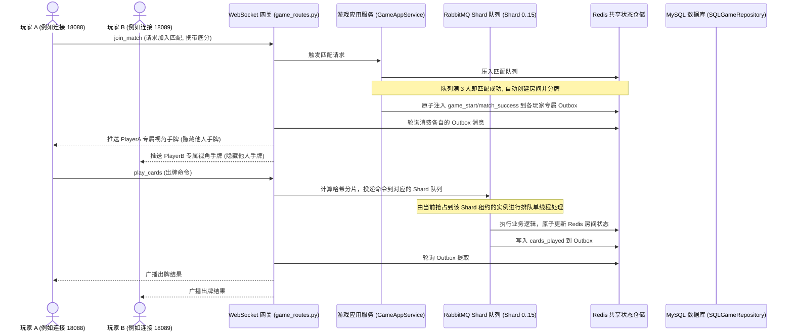

# 🃏 happy_doudizhu — 欢乐斗地主网络对战系统

本项目是一个采用前后端彻底分离架构的“欢乐斗地主”网络对战系统。系统以 **FastAPI + Vue 3** 为核心，搭配 **Redis** 存储匹配队列与对局状态，以及 **MySQL** 落地存储战绩与玩家档案。系统内置了强健的掉线重连机制与自研扑克牌规则引擎，并提供独立的 AI 降级接管机器人，实现了极佳的可玩性与开发调试体验。

> 📢 **致开发者与智能体 (AGENTS)**：
> 本项目任何功能优化与新功能实现，均必须在完成开发后，将对应的新特性、接口变更或配置说明同步更新并写入本 `README.md` 文档中，保持文档与代码功能同步演进。

---

## 🎨 游戏界面巡礼 (Screenshot Tour)

### 1. 账号登录与注册页
玩家通过唯一的账号或昵称快捷注册与登录，进入持久化游戏大厅，所有的欢乐豆和段位战绩将绑定账号，终局持久化。


### 2. 多人游戏大厅
支持底分不同的六大段位场次选择；集成全局欢乐豆富豪排行榜；界面采用流畅的玻璃态毛玻璃视觉设计。


### 3. 实时对局房间
支持逼真的实时叫地主、抢地主、加倍与出牌交互。游戏界面包含精细的头像标识、手牌排列、上家出牌反馈、剩牌提示以及气泡短语聊天。


### 4. 调试控制台与 Mock 模式
为开发与运维人员量言打造的控制台。支持 WebSocket 文本消息调试、广播站内信发送与接收、大文件并发分片上传进度条展示以及系统审计日志的高级筛选与气泡预览。
```text
体验开发 Mock 模式：
如果在前端开发环境下，在 URL 后面附带 `?mock=true` 参数，例如：
http://localhost:5173/lobby?mock=true
即可在无需启动后端的情况下直接体验和预览完整的前端交互界面！
```


---

## ✨ 核心功能特性 (Key Features)

* **🧩 DDD 领域驱动设计实践**：后端严格隔离业务核心与基础设施实现。领域层定义扑克牌编码、洗牌发牌、牌型校验与压制算法以及五大状态的游戏房间状态机。
* **🃏 不洗牌模式算法与基础设施支持**：
  - **领域层算法**：实现切牌（`cut_cards`）保留局部牌序、基于自定义/已回收牌堆的发牌分发（`deal_with_deck`）以及带有完整性校验的残局回收重组（`recycle_cards`）算法。
  - **510K 专属 AI**：经典与不洗牌继续使用 DouZero；510K 不使用其“地主二打一、20/17/17 张”的预训练权重，只借鉴“枚举全部合法动作、状态动作价值网络、并行自博弈和终局回报”的 DMC 方法。线上模型先对全部合法动作评分；进入残局后，仅对模型 Top-2 动作执行一次公开信息确定化模拟，不读取两家真实暗牌。机器人、提示和托管共用同一排序；模型缺失、超时或输出异常时降级到确定性规则基线。规则基线同时评估预计剩余手数、牌权、分牌、听牌压力及拆对子、三条、顺子、炸弹的机会成本，不再依靠固定炸弹阈值。
  - **立即下家听牌阻断门禁**：仅在立即下家公开剩余 1 张且当前桌面为单张时触发；门禁只使用本人手牌、已出牌、座次和公开剩余张数，不读取两家真实暗牌。无论候选来自 510K 模型还是规则 AI，最终排序都必须经过同一安全门禁，优先阻止下家用最后一张牌直接出完。该修复不改变特征版本、网络结构或权重格式，因此无需重新训练模型；后续重新训练时应把该场景纳入固定战术评测集。
  - **前端专属主题 UI 与 Mock 适配**：重构大厅左侧菜单，以同级导航【经典】与【不洗牌】作为玩法切换入口；不洗牌卡片右上角悬挂精美“炸弹多”流光倾斜缎带角标，选中时渲染红金呼吸光晕；大厅对局准备页动态呈现“不洗牌初级场”等专属文案；玩家退出对局时路由自动携带玩法参数还原并高亮大厅之前的匹配模式；对局房间采用专属红黑烈火渐变背景；牌桌中央常驻金色 3D 浮雕“不洗牌模式”立体双边印章，顶栏倍数底分侧边增设红色呼吸霓虹灯“不洗牌场”标签；不洗牌场打出炸弹时全屏触发晃动火红烈焰震荡光效；而在 Mock 模式（`?mock=true&play_mode=no_shuffle`）下，发牌逻辑自适应分段，必出豪华炸弹组合手牌。
  - **前端专属主题 UI 与 Mock 适配**：重构大厅左侧菜单，以同级导航【经典】与【不洗牌】作为玩法切换入口；不洗牌卡片右上角悬挂精美“炸弹多”流光倾斜缎带角标，选中时渲染红金呼吸光晕；大厅对局准备页动态呈现“不洗牌初级场”等专属文案；玩家退出对局时路由自动携带玩法参数还原并高亮大厅之前的匹配模式；对局房间采用专属红黑烈火渐变背景；牌桌中央常驻金色 3D 浮雕“不洗牌模式”立体双边印章，顶栏倍数底分侧边增设红色呼吸霓虹灯“不洗牌场”标签；不洗牌场打出炸弹时全屏触发晃动火红烈焰震荡光效；而在 Mock 模式（`?mock=true&play_mode=no_shuffle`）下，发牌逻辑自适应分段，必出豪华炸弹组合手牌。
* **🃏 510K 特殊牌型识别与压制判定**：
  - **牌型与压制**：510K 识别仅在 `play_mode="fifty_k"` 生效，经典与不洗牌玩法不受影响。压制顺序为“王炸 > 真五十K > 普通炸弹 > 假五十K > 普通牌型”，同级真/假五十K互不压制。
  - **发牌与首出机制**：在 `play_mode == "fifty_k"` 时，发牌方法将 54 张牌（无底牌）均分给三名玩家（每人 18 张手牌），直接跳过叫牌阶段并进入出牌阶段 (`GamePhase.PLAYING`)。系统会自动检测并识别持有梅花 3 (ID为 2) 的玩家，将其设为首出玩家 (`current_turn`)，并在开局播报“梅花3先出”。
  - **局中吃分与可靠划豆**：5、10、K 分别计 5、10、20 分，全副牌总分 140。每个牌墩按“牌墩分数 × 房间底分 × 当前倍数”结算；以 `(room_id, trick_no)` 建立幂等记录，重复命令、CAS 重试或消息重投不会重复划豆。真人余额以数据库为准，机器人使用虚拟余额。
  - **终局结算**：最先出完者赢得当前牌墩，并收割另外两家手中的剩余分牌；输家保留此前已吃到的历史抓分，同时其手中剩余的 5、10、K 会作为终局罚分输出到 `penalty_adjusted_scores`，供 AI 训练、评测和残局搜索使用。每名输家先扣 `4500 × 最终倍数`，再扣“本人剩余分牌 × 房间底分 × 最终倍数”，赢家获得两名输家的实际扣款总额；整局战绩只入账一次。
  - **状态、事件与恢复**：Redis 快照完整保存牌墩、轮次、得分、累计豆变化和余额。一次动作依次广播 `cards_played/turn_passed`、`trick_settled`、`game_over`；开局、重连和五秒状态同步均携带玩法、阶段、截止时间、得分与权威余额，避免分布式模式停在 `SETTLING`。
  - **原生语音播报**：前端出牌展示按当前玩法识别牌型；单张 5、10、K 继续按牌面语音播报，5、10、K 组成的假/真 510K 以及开局"梅花3先出"均从 `/static/audio/fifty_k/{female|male}/` 读取项目托管的 Edge TTS 神经网络语音 MP3。女声使用 `zh-CN-XiaoxiaoNeural`（微软小晓），男声使用 `zh-CN-YunxiNeural`（微软云希），音质接近真人配音。由于开发服务器和后端生产托管都会让 `/static` 优先指向 `backend/static`，这些 MP3 必须同时存在于 `frontend/public/static/audio/fifty_k/` 与 `backend/static/audio/fifty_k/`。开局语音按 `room_id` 去重并跨 WebSocket 断开保留，重连状态与重复 `game_start` 不会重播；经典和不洗牌模式不触发。MP3 加载失败时仅回退普通出牌提示音，不套用炸弹语音、爆炸音效或浏览器朗读。
  - **语音资产生成与许可**：六个开发 MP3 由 `frontend/scripts/generate-fifty-k-voice-assets.py` 使用 Edge TTS 神经网络语音引擎在线生成（需网络连接）；脚本默认同时写入前端 public 目录与后端 static 目录，支持 `--female-voice` / `--male-voice` 自定义声线，并在生成后检查文件大小及 MP3 帧头/ID3 标签。依赖：`pip install edge-tts`。脚本运行后会自动清理同目录下的旧 `.wav` 文件。正式发布或商用前，项目方必须核验 Edge TTS 服务条款，无法确认时替换为原创或明确授权录音；禁止复制第三方游戏音频。详细说明见 `frontend/public/static/audio/fifty_k/README.md`。
  - **510K 专属模型训练**：新增三席对称自博弈环境、54 张实体牌动作编码和动作价值网络。`public_state_v3` 使用最近 15 次动作的 LSTM 历史编码，并显式标记候选动作是否拆对子、三条、顺子或炸弹；只读取本人手牌、已出牌、剩余张数、累计得分和牌墩等公开信息。三名玩家默认共享同一模型，Actor 记录整局实际选择，终局后把相对回报回填到每次状态动作并用 MSE 训练，规则模仿仅作为可选预热。训练产物只在固定评测对规则基线胜率不少于 40%、平均得分不低于基线且非法动作率为 0 时加载；否则提示接口返回 `fifty_k_rule`，达标模型返回 `fifty_k_model`。训练权重和日志不提交 Git。
* **⚡ WebSocket 实时对战网关**：基于双向长连接，实时进行叫地主、出牌、过牌等交互。采用玩家专属个人视角的防作弊手牌广播机制，确保数据公平。
* **🌐 分布式高可用与可靠异步结算**：
  - **分片队列路由 (Shard Routing)**：所有房间的出牌命令，基于房间 ID 的哈希值，被均匀分摊路由至 16 个 RabbitMQ 分片队列中，确保同一个房间的全部指令严格按序执行，规避并发写冲突。
  - **Redis 租约灾备管理 (Lease Failover)**：每个分片队列的所有权由各网关进程通过 Redis 10秒短租约锁（Lua 原子脚本心跳）进行抢占。当某一网关实例宕机时，其余存活实例会在 10-15 秒内自动接管其负责的分片消费，确保服务高可用。
  - **MQ 可靠异步结算**：游戏结束时的数据库结算操作完全解耦，转换为持久化任务推送至 RabbitMQ 异步任务信道 `ddz.game.settlement`，由独立的 Settlement Worker 在事务提交后原子清理 Redis，实现结算流的强一致性与幂等。
  - **开局 Outbox 中转**：跨网关实例匹配开局时，玩家各自视角的 `game_start` 事件被原子注入 Redis Outbox，由各在线实例的网关 Relay 读取推送，实现跨端口无缝收牌。
* **🤖 托管 AI 决策与双层兜底**：匹配超时自动机器人常驻补位，对局中玩家离线自动托管。结合 DouZero 强化学习 AI 模型与 Rule-based 规则兜底 AI，确保出牌合理且不中断。
* **🏆 36级特色排位头衔系统**：涵盖从`包身工`到`至尊`的趣味称号，按对局胜负、炸弹数量、春天等触发原子星数变动。支持低段位新手保护与高段位硬核无保护博弈。
* **🎵 自研 Web Audio 音频引擎**：支持背景音乐的无缝切换，以及出牌（包括“四带二”、“四带二对”等特殊牌型人声配音）、加倍、叫分等动作音效的异步解码与低延迟播放；在“五十K”模式下支持神经网络语音的高保真人声宣布，并在流式发牌完毕后平滑播放。同时对网络重连时的多连接强退与 429 API 流量频次限制进行了静默自愈与中文友好化升级。
* **🛡️ 安全大文件切片上传**：调试控制台支持大文件的 WebSocket 并发分片上传，内置文件名净化、路径穿越防护与分片切片边界校验。
* **📝 完整的审计日志追踪**：对系统核心数据如欢乐豆增减、段位变更和敏感上传进行严密的审计记录，支持防抖异步写入。

---

## 📂 项目目录结构树

```text
happy_doudizhu/
├── backend/                        # 后端项目根目录 (FastAPI + SQLAlchemy)
│   ├── alembic/                    # 数据库迁移脚本及历史版本
│   │   └── versions/               # 具体迁移版本脚本文件
│   ├── app/
│   │   ├── domain/                 # 领域层：纯业务逻辑与核心规则 (无技术细节依赖)
│   │   │   ├── game/               # 游戏核心逻辑
│   │   │   │   ├── card.py         # 扑克牌编码、排序与洗牌发牌规则
│   │   │   │   ├── card_type.py    # 14种牌型智能判定与压制(can_beat)算法
│   │   │   │   └── room.py         # 游戏房间状态机 (五大生命周期阶段流转控制)
│   │   │   └── audit_log/          # 审计日志领域对象及仓储契约
│   │   ├── application/            # 应用层：业务流程编排与用例驱动 (协调指挥官)
│   │   │   ├── game/
│   │   │   │   └── game_app_service.py # 玩家匹配、开局、出牌流程及托管 AI 决策编排
│   │   │   └── audit_log/          # 审计日志记录应用服务
│   │   ├── infrastructure/         # 基础设施层：具体技术选型与工具落地
│   │   │   ├── database/           # 关系型数据库 MySQL 读写实现
│   │   │   │   ├── models.py       # SQLAlchemy 数据库映射模型 (已统一 ddz_ 表前缀及注释)
│   │   │   │   ├── session.py      # 数据库连接池与初始化管理 (含库表自愈机制)
│   │   │   │   └── game_repository.py # SQL 战绩、积分、个人档案物理存取
│   │   │   ├── mq/                 # 站内信 RabbitMQ 适配器与消费者
│   │   │   └── redis/              # Redis 高性能匹配队列与对局房间状态缓存
│   │   └── interfaces/             # 接口层：对外的 API 网关与协议解析
│   │       ├── api/                # REST 接口 (玩家账号、战绩查询、审计检索、分片上传)
│   │       └── websocket/          # 对局长连接网关 (处理 WebSocket 握手与心跳)
│   ├── tests/                      # pytest 单元测试目录 (覆盖率达 90% 以上)
│   └── main.py                     # 后端服务入口 (负责 Lifespan 初始化、CORS 与路由挂载)
├── frontend/                       # 前端项目根目录 (Vue 3 + Vite + Pinia)
│   ├── src/
│   │   ├── assets/                 # 音频 (出牌、加倍、叫分音效) 与图片静态资源
│   │   ├── components/             # 可复用游戏 UI 元素组件
│   │   │   ├── PokerCard.vue       # 单张扑克牌渲染与高亮选取动画
│   │   │   ├── HandCards.vue       # 玩家当前手牌水平排列、排列间距及滑选控制
│   │   │   └── PlayerSeat.vue      # 玩家座席头像、倒计时、叫加倍提示及聊天气泡
│   │   ├── composables/            # 组合式函数封装
│   │   │   └── useGameWebSocket.ts # 斗地主对局 WebSocket 通信与掉线指数退避重连机制
│   │   ├── stores/                 # Pinia 状态管理中心
│   │   │   ├── playerStore.ts      # 管理玩家个人档案、欢乐豆及排位段位变动
│   │   │   └── gameStore.ts        # 全局对局状态、出牌响应及动画状态映射
│   │   ├── views/                  # 页面级视图组件
│   │   │   ├── LoginView.vue       # 登录与快速注册页面
│   │   │   ├── LobbyView.vue       # 多人游戏大厅 (选择低分场次、全局富豪排行榜)
│   │   │   ├── GameRoomView.vue    # 实战对局房间 (抢地主、加倍、对局出牌及结算弹窗)
│   │   │   └── DebugConsoleView.vue # 调试控制台 (实时WS消息调试、大文件分片上传测试)
│   │   └── utils/                  # 辅助工具函数
│   │       └── cardUtils.ts        # 前端手牌大小排序与基础出牌校验
│   ├── package.json                # 前端工程依赖与运行指令配置
│   └── vite.config.ts              # Vite 编译与开发服务器反向代理设置
├── docs/                           # 系统历史设计规格书与实施计划文档
└── AGENTS.md                       # 协同开发智能体的操作约束说明
```

### 各层职责划分

* **领域层 (`backend/app/domain/`)**：
  - **无外部依赖的纯业务逻辑**：定义扑克牌编码、排序、洗牌 (`card.py`) 与 16 种斗地主及510K常见牌型的智能校验与 `can_beat` 压制判定算法 (`card_type.py`)。
  - **房间状态机 (`room.py`)**：严密的五大阶段状态转换 (`MATCHING` -> `DEALING` -> `CALLING` -> `PLAYING` -> `SETTLING`)，规避前后端状态不一致。
* **应用层 (`backend/app/application/`)**：
  - **业务流程编排**：由 `GameAppService` 统一提供匹配排队、自动开局、AI 机器人自动补位、叫地主/出牌的流程驱动与出箱消息管理。
* **基础设施层 (`backend/app/infrastructure/`)**：
  - **持久化与外部依赖**：提供 MySQL 的 SQLAlchemy ORM 仓储、Redis 匹配与状态仓储、租约管理器 (`redis_lease.py`)、RabbitMQ 站内信与可靠结算总线。
* **接口层 (`backend/app/interfaces/`)**：
  - **外部通信网关**：包含面向普通 REST 的游戏 API，大文件分片上传路由与 WebSocket 调试接口，以及斗地主的核心 WebSocket 对战网关 (`websocket/game_routes.py`)。

---

## ⚙️ 运行环境与先决条件 (Prerequisites)

在本地运行或开发本项目之前，请确保您的系统已安装并配置以下软件环境：

* **Python 运行环境**: 3.10.20 (**后端强制要求使用项目专用 conda 环境 `hmp_ai`**)
  - **解释器物理路径**：`D:\ProgramData\miniconda3\envs\hmp_ai\python.exe`
  - **原因**：系统默认 Python 3.13 与 SQLAlchemy 2.0.25 存在类继承静态属性兼容性问题，会导致测试收集与服务启动崩溃。
* **Node.js**: 18.0+ (推荐 v20.x 或以上)
* **MySQL**: 5.7+ 或 8.0+
* **Redis**: 6.0+
* **RabbitMQ**: 3.8+

---

## 🚀 快速启动指南

### 1. 数据库准备与配置
1. 复制或创建后端目录下的环境变量配置文件 `.env`：
   ```ini
   PORT=18088
   APP_ENV=development
   DB_HOST=127.0.0.1
   DB_PORT=3306
   DB_USER=root
   DB_PASSWORD=your_password
   DB_NAME=happy_doudizhu
   REDIS_HOST=127.0.0.1
   REDIS_PORT=6379
   REDIS_PASSWORD=your_redis_password
   MQ_HOST=127.0.0.1
   MQ_PORT=5672
   MQ_USER=guest
   MQ_PASSWORD=guest
   GAME_AUTH_SECRET=replace-with-at-least-32-random-characters
   GAME_AUTH_TOKEN_TTL_SECONDS=604800
   DISTRIBUTED_MODE=True # 本地多实例跨网关调试请设为 True
   ```
   > 生产环境必须将 `APP_ENV` 设置为 `production`，并显式配置至少 32 个字符的随机 `GAME_AUTH_SECRET`，否则服务会拒绝启动。
2. 运行一键初始化脚本，自动检测并创建 MySQL 数据库及所有表结构：
   ```powershell
   cd backend
   D:\ProgramData\miniconda3\envs\hmp_ai\python.exe scripts/create_db.py
   ```

### 2. 后端安装与启动
1. 安装项目依赖：
   ```powershell
   cd backend
   D:\ProgramData\miniconda3\envs\hmp_ai\python.exe -m pip install -r requirements.txt
   ```
2. 启动 FastAPI 后端服务（默认主实例在 18088 端口）：
   ```powershell
   D:\ProgramData\miniconda3\envs\hmp_ai\python.exe main.py
   ```
3. 启动第二个实例以进行分布式跨网关联调（PowerShell 下执行）：
   ```powershell
   $env:PORT=18089; $env:INSTANCE_ID="instance-B"; D:\ProgramData\miniconda3\envs\hmp_ai\python.exe main.py
   ```

### 3. 前端安装与启动
1. 进入前端目录安装依赖并运行开发服务器：
   ```bash
   cd frontend
   npm install
   npm run dev
   ```
2. 网页开发联调：在浏览器访问 `http://localhost:5173`。
3. 跨网关静态一体化调试：后端会自动托管 `frontend/dist` 打包后的前端页面。
   - 网页 A 直接访问 `http://localhost:18088`
   - 网页 B 直接访问 `http://localhost:18089`
   - 两者会自动关联各自的网关接口并可以一起匹配进同一个房间打牌！

### 4. 数据库版本管理与迁移 (Alembic)
1. **自动比对并生成迁移版本脚本** (开发环境修改 `models.py` 后)：
   ```powershell
   cd backend
   D:\ProgramData\miniconda3\envs\hmp_ai\python.exe -m alembic revision --autogenerate -m "修改描述"
   ```
2. **应用迁移更新数据库表结构**：
   ```powershell
   D:\ProgramData\miniconda3\envs\hmp_ai\python.exe -m alembic upgrade head
   ```
3. **回滚最近一次迁移**：
   ```powershell
   D:\ProgramData\miniconda3\envs\hmp_ai\python.exe -m alembic downgrade -1
   ```

### 5. 运行测试命令
* **后端全量测试**：
  ```powershell
  cd backend
  D:\ProgramData\miniconda3\envs\hmp_ai\python.exe -m pytest tests/ -v
  ```
* **后端快速测试 (失败即停)**：
  ```powershell
  cd backend
  D:\ProgramData\miniconda3\envs\hmp_ai\python.exe -m pytest tests/ -x -q --tb=short
  ```
* **前端单元测试**：
  ```bash
  cd frontend
  npm run test:unit
  ```
* **前端生产编译打包**：
  ```bash
  cd frontend
  npm run build
  ```

---

## 🧭 系统全套 API 与功能地图

为保障文档永不过期与极简维护，常规 REST API 请求和字段详情请直接启动后端服务并访问 **`http://localhost:18088/docs` (Swagger 交互式文档)**。以下为全套系统可用接口地图：

### 1. 常规 REST 接口地图

| 模块分类 | 请求方法 | 路由端点 | 鉴权等级 | 业务说明 |
| :--- | :--- | :--- | :--- | :--- |
| **玩家账号** | `POST` | `/api/game/auth/register` | 免鉴权 | 注册新玩家，要求账号 $\ge 3$ 位，密码 $\ge 6$ 位 |
| **玩家账号** | `POST` | `/api/game/auth/login` | 免鉴权 | 玩家登录，校验密码并返回 `auth_token` 令牌 |
| **玩家档案** | `GET` | `/api/game/profile/{player_id}` | Bearer Token | 获取玩家当前欢乐豆总数、排位星数、段位称号与胜率 |
| **对局凭证** | `POST` | `/api/game/auth/ticket` | Bearer Token | 为 WebSocket 连接申请临时单次失效的安全握手 Ticket |
| **富豪榜单** | `GET` | `/api/game/leaderboard` | Bearer Token | 获取全局前十名金豆大富豪的实时排行榜单 |
| **开发测试** | `POST` | `/api/game/dev/beans` | 开发环境放行 | 敏感测试接口：手动增加/扣减指定玩家的欢乐豆资产 |
| **开发测试** | `POST` | `/api/game/dev/rank` | 开发环境放行 | 敏感测试接口：手动更改指定玩家的排位星数与大段位 |
| **开发测试** | `POST` | `/api/game/auth/settlement/replay` | API_TOKEN 校验 | 敏感测试接口：人工重放并提取结算死信队列任务回主队列 |
| **健康探活** | `GET` | `/api/game/health/live` | 免鉴权 | 进程存活度探活（Liveness check），无数据库 IO |
| **健康探活** | `GET` | `/api/game/health/ready` | 免鉴权 | 外部就绪度探活（Readiness check），校验中间件连通性 |
| **大文件上传** | `POST` | `/api/uploads` | API_TOKEN 校验 | 分片并发上传数据切片、取消切片与大文件切片最终合并 |
| **站内邮件** | `GET` / `POST`| `/api/messages` | API_TOKEN 校验 | 站内公告信件投递与特定玩家收件箱拉取，支持 MQ 广播 |
| **审计安全** | `GET` | `/api/audit-logs` | API_TOKEN 校验 | 高级筛选检索后台关于资金、敏感上传、权限操作的审计日志 |

---

### 2. WebSocket 长连接交互协议

对局过程完全基于 WebSocket 事件驱动交互。

#### 客户端发起动作 (Client Actions)
客户端往对战网关发送消息时使用统一格式：`{"action": "动作名", ...}`

* **开始匹配 / 放弃匹配**：
  ```json
  {"action": "join_match", "nickname": "玩家昵称", "base_score": 80}
  {"action": "cancel_match"}
  ```
* **叫地主 / 放弃叫分**：
  ```json
  {"action": "call_landlord", "score": 3} // score 可选 1 | 2 | 3
  {"action": "skip_call"}
  ```
* **加倍选择**：
  ```json
  {"action": "choose_doubling", "choice": "double"} // choice 可选: double | super | none
  ```
* **出牌 / 过牌 (不要)**：
  ```json
  {"action": "play_cards", "cards": [48, 49, 50]} // 传入要打出的扑克牌 ID 数组
  {"action": "pass_turn"}
  ```
* **托管状态设置**：
  ```json
  {"action": "set_auto_play", "enabled": true}
  ```
* **文字/快捷聊天**：
  ```json
  {"action": "chat", "msg_id": 3}
  ```
* **获取 AI 提示**：
  ```json
  {"action": "get_ai_hints"}
  ```

#### 服务端广播事件 (Server Events)
服务端在广播时会基于座席视角过滤数据，防止作弊。

* **对局开始 (`game_start`)**：
  ```json
  {
    "event": "game_start",
    "room_id": "room_xxx",
    "hand": [53, 52, 50, 49, 48], // 当前玩家个人手牌 ID 列表
    "current_turn": "player_123",  // 第一个开始叫分的玩家 ID
    "turn_deadline": 1782390120,   // 当前操作超时的绝对时间戳
    "players": [
      {"id": "p1", "nickname": "玩家A", "is_ai": false, "remaining": 17},
      {"id": "p2", "nickname": "机器人", "is_ai": true, "remaining": 17}
    ]
  }
  ```
* **地主确定 (`landlord_decided`)**：
  ```json
  {
    "event": "landlord_decided",
    "landlord": "p1",
    "bottom_cards": [51, 47, 43], // 广播三张地主专属明面底牌
    "multiplier": 2
  }
  ```
* **出牌成功 (`cards_played`)**：
  ```json
  {
    "event": "cards_played",
    "player": "p1",
    "cards": [48, 49, 50],
    "card_type": "triple",         // 智能识别的牌型
    "next_turn": "p2"
  }
  ```
* **对局结束 (`game_over`)**：
  ```json
  {
    "event": "game_over",
    "winner": "p1",
    "winner_side": "landlord",
    "scores": {"p1": 240, "p2": -120, "ai_bot": -120},
    "multiplier": 8,
    "all_hands": {
      "p1": [],
      "p2": [32, 28],
      "ai_bot": [12, 8, 4]
    }
  }
  ```

---

## 🏆 独特排位头衔系统 (Rank System)

游戏包含一套富有趣味的 **36 级特色排位头衔系统**，玩家通过赢取星星提升段位，展现身价头衔。

### 1. 36级头衔一览
头衔由低到高划分为 36 个大级别：
* **新手期 (1-9级)**：`包身工`、`短工`、`长工`、`中农`、`富农`、`掌柜`、`商人`、`小财主`、`大财主`。
* **中产期 (10-21级)**：`县尉`、`县丞`、`县令`、`通判`、`主事`、`知府`、`员外郎`、`郎中`、`侍郎`、`巡抚`、`总督`、`尚书`。
* **达贵期 (22-35级)**：`大学士`、`太保`、`太傅`、`太师`、`三等伯`、`二等伯`、`一等伯`、`三等侯`、`二等侯`、`一等侯`、`辅国公`、`镇国公`、`郡王`、`亲王`。
* **至尊大满贯 (36级)**：`至尊`。

> 除【至尊】外，每个头衔划分为 `IV, III, II, I` 四个子级别。

### 2. 升降星状态机规则
后端在每局终局结算时对段位执行原子变动：
* **加星**：普通胜利积 **1 星**；使用炸弹/王炸或者以春天获胜（爆发性胜利），星星 **+2**。
* **新手保护期 (1-9级)**：小段位满 **3 星** 即可晋级；输牌不扣星，不降段。
* **中产晋升期 (10-21级)**：小段位满 **4 星** 晋级；输牌扣 **1 星**；大段位触发保护机制（不会从“县尉IV”降回“大财主I”）。
* **无保护硬核博弈 (22-35级)**：小段位满 **5 星** 晋级；输牌扣 **1 星**；段位无任何保护（降星直接降大级别）。

---

## 🤖 托管 AI 决策与双层决策引擎

对局系统集成了高可用的 AI 机制，保障流畅的单机/网络对战体验：

1. **自动补位与托管**：匹配等待超时 10 秒后，AI 机器人将自动补齐空位开局；对局中玩家掉线或主动开启托管时，AI 会无缝接管出牌。
2. **双层决策引擎**：
   - **经典 / 不洗牌**：优先使用 DouZero；推理模型不可用时降级为规则 AI。
   - **510K**：使用专属动作价值模型，并在自己剩余不超过 9 张或任一对手剩余不超过 5 张时启用轻量公开信息残局搜索；模型清单、规则版本、权重校验值和离线评测门槛任一不通过时，自动降级为规则 AI，保障机器人、提示和托管不中断。

### 510K 模型训练与加载

当前模型规则版本为 `fifty_k_v1`，特征版本为 `public_state_v3`。线上权重累计训练 `40,000` 局；采用 Top-2×1 公开信息残局搜索后，在 1,000 局固定牌局、三座位轮换评测中对规则 AI 胜率为 `43.3%`、平均得分差为 `+5.40`、非法动作率为 `0`。v3 与旧权重维度不兼容：旧清单会被明确拒载并自动回退到 `fifty_k_rule`，必须重新训练生成 `model.pt` 与 `manifest.json`。

正式训练建议先做 5,000 局方向验证，再执行 20,000 局课程训练。以下命令前 5,000 局可选学习规则完整排序，随后切换为三座位共享模型的 DMC 自博弈；正式评测按同一副牌轮换三个座位：

```powershell
cd backend
D:\ProgramData\miniconda3\envs\hmp_ai\python.exe -m app.training.fifty_k.trainer --episodes 20000 --teacher-episodes 5000 --teacher-min-agreement 0.80 --actors 2 --evaluate-games 500
```

训练默认行为：

- 线上、训练和正式评测都枚举并评分全部合法动作，不再截断规则前 4 个候选。
- 正式强化阶段三名玩家共享同一模型；每次实际选择都记录为轨迹，终局后按该玩家的相对回报回填，使用 MSE 与梯度裁剪更新。
- `public_state_v3` 编码 54 张实体牌、三家公开出牌、累计得分、剩余张数、牌墩状态和最近 15 次动作；历史由 LSTM 编码，并显式提供拆对子、拆三条、拆顺子、拆炸弹、翅膀大小和剩余分牌等结构特征。
- 模型只使用玩家可见信息，不读取真实对手手牌。残局搜索根据本人手牌、公开出牌和两家剩余张数重分配未见牌，固定状态种子保证同一局面可复现；搜索只校正模型 Top-2，避免用规则 AI 覆盖模型的全局候选排序。
- `manifest.json` 写入 `rules_version`、`features_version`、`training_episodes`、`evaluation_games`、残局搜索参数、权重 SHA-256 与正式评测指标。
- 只有对规则基线胜率 `>= 40%`、平均得分差 `>= 0` 且非法动作率为 `0` 的产物才会被后端加载；否则可靠降级为规则 AI。
- Windows 使用 CPU Actor，多进程类型均定义在模块顶层，已通过双进程 `spawn` 冒烟测试；有 CUDA 时学习器自动使用 GPU。

固定战术回归位于 `backend/tests/test_fifty_k_tactics.py`，完整分类与后续待扩展场景见 [510K 固定战术测试矩阵](docs/testing/510K固定战术测试矩阵.md)。当前覆盖合法牌型、压制层级、首出减手、对子/顺子/连对/炸弹保护、三带翅膀、四带二、最小代价跟牌、特殊牌节制、直接跑完、首家禁过和跟牌可过。模型胜率达标之外仍必须通过该战术集，避免平均胜率掩盖明显坏棋。

<!-- 以下保留的是 public_state_v2 旧训练说明，不再作为当前运行依据。

510K 不兼容现有斗地主预训练权重，必须从专属自博弈训练开始。使用项目规定的 Python 环境执行：

```powershell
cd backend
D:\ProgramData\miniconda3\envs\hmp_ai\python.exe -m app.training.fifty_k.trainer --episodes 20000 --actors 2 --evaluate-games 500
```

当前默认模型位于 `backend/app/domain/game/weights/fifty_k/`，规则版本为 `fifty_k_v1`、特征版本为 `public_state_v2`。2026-07-15 的 20,000 局续训验收产物在 500 局正式评测中对规则 AI 胜率为 `53.0%`、平均得分差为 `+11.66`、非法动作率为 `0`；清单内的 SHA-256 必须与 `model.pt` 一致，否则后端拒绝加载并自动降级。

已有同一 `features_version` 的检查点时，可跳过重复 teacher 并以较低学习率继续 rollout；训练器会先登记续训基线，后续检查点退化时恢复该权重：

```powershell
D:\ProgramData\miniconda3\envs\hmp_ai\python.exe -m app.training.fifty_k.trainer --episodes 4000 --teacher-episodes 0 --initial-checkpoint scratch\fifty_k_public_state_v2_multisample3_4000\model.pt --learning-rate 0.0001 --exploration-rate 0.15 --min-exploration-rate 0.03 --actors 2 --evaluate-games 1000
```

Windows 下 `--actors` 使用 CPU 并行采样，整次训练会复用同一组采样进程；检测到 CUDA 时学习器自动使用 GPU。课程训练默认先进行至少 2,000 局 `teacher`：模型学习规则 AI 对全部合法候选的完整排序，每个采样批次默认重复优化 4 次，避免 5,000 局仅产生约 79 次参数更新；每 500 局使用 50 个固定牌局验证 Top-1 动作一致率，未达到 85% 时继续模仿，不会提前进入策略提升。teacher 阶段独立保存规则一致率最高的权重，不使用尚无比较意义的中途胜率检查点覆盖；通过门禁时立即执行正式评测并登记 teacher 基线，后续 rollout 只有超过该基线的安全权重才会成为新的最佳模型。

rollout 使用固定容量蓄水池，从一局内的全部模型决策中等概率保留多个决策点，不再只覆盖开局，也不再因每局单样本中大量“所有候选终局相同”的无梯度局面浪费训练。默认每局保留 3 个决策点，可用 `--rollout-samples-per-episode` 调整；选中局面会完整快照，并在本局结束后对规则排序靠前的候选分别模拟到终局。为保证标签与玩家可见信息一致，模拟不会保留服务器掌握的两家真实暗牌，而是保留本人手牌、已出牌和两家剩余张数，将未见牌随机重分配给对手；同一决策的全部候选共享相同确定化局面并对多次确定化奖励求平均，默认 2 次，可用 `--rollout-determinizations` 调整。终局奖励只用于学习候选之间的两两相对顺序，同值候选不产生梯度，不再让绝对值回归破坏动作排序。每对候选的排序损失按终局奖励差加权，使约 1000 分的胜负翻转始终高于最多 140 分的分牌收益，落实“胜局优先、吃分次之”。rollout 默认以 `1.0` 权重保留完整 teacher 排序损失，并与 teacher 一样每个采样批次重复优化 4 次，避免 2,000 局 rollout 只有约 32 次参数更新；可用 `--rollout-updates-per-batch` 调整。每个 rollout 正式检查点先执行固定牌局一致率保护；低于 75% 时自动恢复最佳 teacher 权重并清空 Adam 动量，不评测或保存已拒绝的权重。正式评测仍只保存严格更优权重，但考虑到 300 局小样本胜率波动，未创新高且相对最佳下降不超过 3 个百分点时视为统计持平，保留当前训练状态继续累计；下降超过 3 个百分点或非法率变差时才恢复最佳权重并重置优化器。可用 `--checkpoint-max-win-rate-drop` 调整该容差。teacher 阶段错过的检查点会直接顺延，不会在刚进入 rollout 时集中补测。训练结束时如果最后一段 rollout 尚未到达周期检查点，会在恢复最佳权重前自动执行一次同口径最终检查点，避免短程训练的尾段结果未经评测便被丢弃。训练器在创建模型前应用 `--seed` 到 PyTorch CPU/CUDA 随机数生成器，使同配置初始权重可复现。

线上与离线正式评测共用同一个公开信息残局搜索器。搜索只在自己剩余不超过 9 张或任一对手剩余不超过 5 张时触发，对规则 Top-4 候选分别进行 2 次暗牌确定化并模拟到终局；平分时保留原规则顺序。确定化随机种子仅由当前公开状态生成，因此相同公开局面可复现，即使交换服务器中的两家真实暗牌也不会改变决策。搜索异常、超步或状态不完整时自动保留原模型/规则候选顺序，不会阻断机器人、托管或提示链路。

模型输入仍只包含玩家可见信息。`public_state_v2` 特征结构在原有手牌、候选、公开历史、未出现牌、剩余张数和当前牌墩分基础上，增加三家累计得分、最近 5 次动作的相对座次、当前牌权座次和已完成牌墩数；训练清单必须包含匹配的 `features_version`，旧清单或旧维度权重会被明确拒载并自动回退规则 AI。终局奖励和正式评测使用 `penalty_adjusted_scores`，也就是在历史抓分基础上继续扣除输家手中剩余 5、10、K 罚分后的有效分，避免模型学会把分牌留到最后。默认每 64 局输出阶段、批次 Top-1、当前阶段更新次数、固定门禁一致率、规则/模拟样本数、模拟样本的开局/中局/残局分布、损失、耗时和带探索训练胜率；带探索训练胜率包含随机探索，只用于观察采样过程，模型强度以关闭探索的正式检查点评测为准。可通过 `--initial-checkpoint`、`--learning-rate`、`--exploration-rate`、`--min-exploration-rate`、`--teacher-episodes`、`--teacher-evaluation-games`、`--teacher-evaluation-interval`、`--teacher-min-agreement`、`--teacher-updates-per-batch`、`--rollout-updates-per-batch`、`--rollout-samples-per-episode`、`--rollout-min-agreement`、`--rollout-candidates`、`--imitation-weight`、`--batch-size`、`--checkpoint-interval` 和 `--checkpoint-evaluation-games` 调整策略。rollout 阶段每 2,000 局进行 100 局正式检查点评测并只保留最优权重；只有“对规则基线胜率 ≥ 40%、平均得分差 ≥ 0、非法动作率 = 0”的模型才会被加载。默认产物目录为 `backend/app/domain/game/weights/fifty_k/`，也可通过 `FIFTY_K_MODEL_DIR` 指向已验收目录。训练完成后仅需重启后端；权重与训练日志均不纳入 Git。

-->

---

## 🔄 核心对局与匹配数据流向



---

## 🙏 开源依赖与鸣谢 (Credits & Dependencies)

本项目在开发过程中，深受开源社区众多优秀项目启发与支撑，特此向以下 GitHub 优质开源项目及团队致以最诚挚的敬意：

* **[kwai/douzero](https://github.com/kwai/douzero)** — 经典的基于强化学习（DMC）的斗地主 AI 训练框架。
* **[tiangolo/fastapi](https://github.com/tiangolo/fastapi)** — 高性能的 Python 异步 Web 框架。
* **[sqlalchemy/sqlalchemy](https://github.com/sqlalchemy/sqlalchemy)** — 极具工业强度且设计优雅的 Python SQL ORM 映射器。
* **[redis/redis-py](https://github.com/redis/redis-py)** — 强大的 Redis 异步 Python 客户端驱动。
* **[mosbrupture/aio-pika](https://github.com/mosbrupture/aio-pika)** — 专为 asyncio 打造的 RabbitMQ 异步驱动。
* **[vuejs/core](https://github.com/vuejs/core)** — 渐进式 JavaScript 框架。
* **[vitejs/vite](https://github.com/vitejs/vite)** — 极速的下一代前端开发与构建工具。
* **[vuejs/pinia](https://github.com/vuejs/pinia)** — 专为 Vue 打造的轻量状态管理库。
