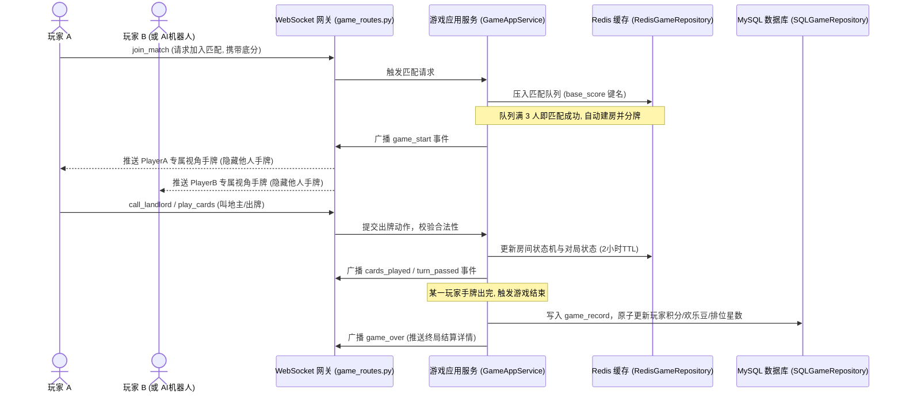

# 🃏 happy_doudizhu — 欢乐斗地主网络对战系统

本项目是一个采用前后端彻底分离架构的“欢乐斗地主”网络对战系统。系统以 **FastAPI + Vue 3** 为核心，搭配 **Redis** 存储匹配队列与对局状态，以及 **MySQL** 落地存储战绩与玩家档案。系统内置了强健的掉线重连机制与自研扑克牌规则引擎，并提供独立的 AI 降级接管机器人，实现了极佳的可玩性与开发调试体验。

---

## 🎨 游戏界面巡礼 (Screenshot Tour)

### 1. 账号登录与注册页
玩家通过唯一的账号或昵称快捷注册与登录，进入持久化游戏大厅，所有的欢乐豆和段位战绩将绑定账号，终局持久化。


### 2. 多人游戏大厅
支持底分不同的六大段位场次选择；集成全局欢乐豆富豪排行榜；界面采用流畅的玻璃态毛玻璃视觉设计。


### 3. 实时对局房间
支持逼真的实时叫地主、抢地主、加倍与出牌交互。游戏界面包含精细的头像标识、手牌排列、上家出牌反馈、剩牌提示以及气泡短语聊天。


### 4. 调试控制台与 Mock 模式
为开发与运维人员量身打造的控制台。支持 WebSocket 文本消息调试、广播站内信发送与接收、大文件并发分片上传进度条展示以及系统审计日志的高级筛选与气泡预览。
```text
体验开发 Mock 模式：
如果在前端开发环境下，在 URL 后面附带 `?mock=true` 参数，例如：
http://localhost:5173/lobby?mock=true 
即可在无需启动后端的情况下直接体验和预览完整的前端交互界面！
```


---

## ✨ 核心功能特性 (Key Features)

* **🧩 DDD 领域驱动设计实践**：后端严格隔离业务核心与基础设施实现。领域层定义扑克牌编码、洗牌发牌、牌型校验与压制算法以及五大状态的游戏房间状态机。
* **⚡ WebSocket 实时对战网关**：基于双向长连接，实时进行叫地主、出牌、过牌等交互。采用玩家专属个人视角的防作弊手牌广播机制，确保数据公平。
* **🤖 托管 AI 决策与双层兜底**：匹配超时自动机器人常驻补位，对局中玩家离线自动托管。结合 DouZero 强化学习 AI 模型与 Rule-based 规则兜底 AI，确保出牌合理且不中断。
* **🏆 36级特色排位头衔系统**：涵盖从`包身工`到`至尊`的趣味称号，按对局胜负、炸弹数量、春天等触发原子星数变动。支持低段位新手保护与高段位硬核无保护博弈。
* **🎵 自研 Web Audio 音频引擎**：支持背景音乐的无缝切换，以及出牌、加倍、叫分等动作音效的异步解码与低延迟播放。
* **🛡️ 安全大文件切片上传**：调试控制台支持大文件的 WebSocket 并发分片上传，内置文件名净化、路径穿越防护与分片切片边界校验。
* **📝 完整的审计日志追踪**：对系统核心数据如欢乐豆增减、段位变更和敏感上传进行严密的审计记录，支持防抖异步写入。

---

## 📂 项目目录结构树

```text
happy_doudizhu/
├── backend/                 # FastAPI 异步后端服务
│   ├── app/
│   │   ├── domain/          # 领域层：纯业务规则、牌型判定、叫地主/出牌状态机
│   │   ├── application/     # 应用层：对局匹配编排、AI 自动回合驱动
│   │   ├── infrastructure/  # 基础设施层：数据库/Redis/RabbitMQ驱动、鉴权与安全
│   │   └── interfaces/      # 接口层：REST API 路由与 WebSocket 对局/调试网关
│   ├── alembic/             # 数据库迁移脚本
│   ├── tests/               # pytest 自动化测试用例
│   └── main.py              # 后端服务启动入口
├── frontend/                # Vue 3 + Vite 前端客户端
│   ├── src/
│   │   ├── views/           # 页面视图（Login、Lobby、GameRoom、DebugConsole 等）
│   │   ├── components/      # UI 组件（扑克牌 PokerCard、手牌 HandCards 等）
│   │   ├── stores/          # Pinia 状态管理（playerStore、gameStore）
│   │   └── utils/           # 前端扑克牌与牌型判定工具
│   └── vite.config.ts       # 前端构建与开发反向代理配置
├── docs/                    # 设计规格说明书与实施计划文档
└── AGENTS.md                # 智能体协同开发指南
```

---

## ⚙️ 运行环境与先决条件 (Prerequisites)

在本地运行或开发本项目之前，请确保您的系统已安装以下软件环境：

* **Python**: 3.10.20 (**强制使用项目专用 conda 环境 `hmp_ai`**)
  > ⚠️ **重要警告**：本地默认全局 Python 3.13 解释器与项目依赖 `SQLAlchemy 2.0.25` 存在已知的类声明兼容性问题（如 `__static_attributes__` 和 `__firstlineno__` 缺失报错）。请确保后端始终使用专用解释器路径：`D:\ProgramData\miniconda3\envs\hmp_ai\python.exe` 运行。
* **Node.js**: 18.0+ (推荐 v20.x 或以上)
* **MySQL**: 5.7+ 或 8.0+
* **Redis**: 6.0+ (用于存放匹配队列和房间状态)
* **RabbitMQ**: 3.8+ (可选，用于站内信通知的广播分发)

---

## 🚀 快速启动指南

### 1. 数据库准备与配置

1. 复制或创建后端目录下的环境变量配置文件 `.env`：
   ```ini
   PORT=18088
   DB_HOST=127.0.0.1
   DB_PORT=3306
   DB_USER=root
   DB_PASSWORD=your_password
   DB_NAME=happy_doudizhu
   REDIS_HOST=127.0.0.1
   REDIS_PORT=6379
   REDIS_PASSWORD=your_redis_password
   RABBITMQ_HOST=127.0.0.1
   RABBITMQ_PORT=5672
   RABBITMQ_USER=guest
   RABBITMQ_PASSWORD=guest
   ```
2. 运行一键初始化脚本，自动检测并创建 MySQL 数据库 `happy_doudizhu` 及其所有表结构：
   ```powershell
   # 请确保当前终端处于 backend 目录下，且使用的是 hmp_ai 专属环境的 Python
   cd backend
   D:\ProgramData\miniconda3\envs\hmp_ai\python.exe scripts/create_db.py
   ```

### 2. 后端启动

1. 安装项目依赖：
   ```powershell
   cd backend
   D:\ProgramData\miniconda3\envs\hmp_ai\python.exe -m pip install -r requirements.txt
   ```
2. 启动 FastAPI 后端服务：
   ```powershell
   D:\ProgramData\miniconda3\envs\hmp_ai\python.exe main.py
   ```

### 3. 前端配置与启动

1. 进入前端目录：
   ```bash
   cd frontend
   ```
2. 安装项目依赖：
   ```bash
   npm install
   ```
3. 启动开发服务器：
   ```bash
   npm run dev
   ```
4. 启动成功后，在浏览器访问 `http://localhost:5173` 即可开始对局。

---

## 🔄 核心对局与匹配数据流向

整个游戏系统的用户匹配、实时叫分、打牌到终局结算，依赖于 Redis 缓存的低延迟性能和 MySQL 的持久化保障。以下是核心数据流向时序图：



---

## ⚡ WebSocket 核心交互协议

对局过程完全基于 WebSocket 事件驱动交互。核心交互事件协议如下：

### 1. 客户端发起动作 (Client Actions)
客户端往对战网关发送消息时使用统一格式：`{"action": "动作名", ...}`

* **开始匹配 / 取消匹配**：
  ```json
  {"action": "join_match", "nickname": "玩家昵称", "base_score": 80}
  {"action": "cancel_match"}
  ```
* **叫地主 / 不叫 / 抢地主 / 不抢**：
  ```json
  {"action": "call_landlord", "score": 3}
  {"action": "skip_call"}
  ```
* **加倍 / 超级加倍 / 不加倍**：
  ```json
  {"action": "choose_doubling", "choice": "double"} // choice 可选: double | super | none
  ```
* **出牌 / 过牌**：
  ```json
  {"action": "play_cards", "cards": [48, 49, 50]} // 传入出牌 ID 数组
  {"action": "pass_turn"}
  ```

### 2. 服务端广播事件 (Server Events)
服务端会根据不同事件向房间内玩家推送更新。为保证游戏公平性，向不同座席广播时会过滤数据，隐藏他人手牌并只暴露其余手牌张数。

* **对局开始 (`game_start`)**：
  ```json
  {
    "event": "game_start",
    "room_id": "room_xxx",
    "hand": [53, 52, 50, 49, 48], // 当前玩家被分配的手牌 ID 列表
    "current_turn": "player_123",  // 第一个叫分的座席 ID
    "turn_deadline": 1782390120,   // 当前回合超时的绝对时间戳
    "players": [
      {"id": "p1", "nickname": "玩家A", "is_ai": false, "remaining": 17},
      {"id": "p2", "nickname": "机器人", "is_ai": true, "remaining": 17}
    ]
  }
  ```
* **地主确定 (`landlord_decided`)**：
  ```json
  {
    "event": "landlord_decided",
    "landlord": "p1",
    "bottom_cards": [51, 47, 43], // 广播三张明面底牌
    "multiplier": 2                // 当前房间倍数翻倍
  }
  ```
* **出牌成功 (`cards_played`)**：
  ```json
  {
    "event": "cards_played",
    "player": "p1",
    "cards": [48, 49, 50],
    "card_type": "triple",         // 智能识别的牌型
    "next_turn": "p2"              // 下一个出牌回合的玩家 ID
  }
  ```

---

## 🏆 独特排位头衔系统 (Rank System)

游戏包含一套富有趣味的 **36 级特色排位头衔系统**，玩家通过赢取星星提升段位，展现身价头衔。

### 1. 36级头衔一览
头衔由低到高划分为 36 个大级别：
* **新手期 (1-9级)**：`包身工`、`短工`、`长工`、`中农`、`富农`、`掌柜`、`商人`、`小财主`、`大财主`。
* **中产期 (10-21级)**：`县尉`、`县丞`、`县令`、`通判`、`主事`、`知府`、`员外郎`、`郎中`、`侍郎`、`巡抚`、`总督`、`尚书`。
* **达贵期 (22-35级)**：`大学士`、`太保`、`太傅`、`太师`、`三等伯`、`二等伯`、`一等伯`、`三等侯`、`二等侯`、`一等侯`、`辅国公`、`镇国公`、`郡王`、`亲王`。
* **终极大满贯 (36级)**：`至尊`。

> 除【至尊】外，每个头衔划分为 `IV, III, II, I` 四个子级别。

### 2. 升降星状态机规则
后端通过 `SQLGameRepository` 在每局终局结算时对段位执行原子变动：
* **爆发胜利加星**：普通胜利积 **1 星**；使用炸弹/王炸或者以春天获胜（爆发性胜利），星星 **+2**。
* **新手保护机制 (1-9级)**：小段位满 **3 星** 即可晋级；输牌不扣星，不降段。
* **中大段位保护 (10-21级)**：小段位满 **4 星** 晋级；输牌扣 **1 星**；大段位触发保护机制（例如不会从“县尉IV”降回“大财主I”）。
* **无保护硬核博弈 (22-35级)**：小段位满 **5 星** 晋级；输牌扣 **1 星**；段位无任何保护（降星可直接跌落大级别）。

---

## 🤖 托管 AI 决策与降级策略

对局系统集成了高可用的 AI 机制，保障流畅的网络对战体验：

1. **自动补位与托管**：匹配等待超时 10 秒后，AI 机器人将自动补齐空位开局；对局中玩家掉线时，AI 会无缝接管出牌。
2. **双层决策引擎**：
   - **DouZero 强化学习 AI**：优先调用基于 DeepMind 强化学习训练的 DouZero AI 进行精细的算牌与出牌决策。
   - **规则兜底 (Rule-based AI)**：若 DouZero 推理模型未加载或出现计算异常，系统会瞬间降级到规则 AI，依据手牌顺位、大牌压制等预设规则执行合理出牌，保障人机对战完全不中断。

---

## 🙏 开源依赖与鸣谢 (Credits & Dependencies)

本项目在开发过程中，深受开源社区众多优秀项目启发与支撑，特此向以下 GitHub 优质开源项目及团队致以最诚挚的敬意：

### 1. 算法与决策 AI 模型
* **[kwai/douzero](https://github.com/kwai/douzero)** — 经典的基于强化学习（Deep Monte-Carlo, DMC）的斗地主 AI 训练框架。

### 2. 后端异步生态依赖
* **[tiangolo/fastapi](https://github.com/tiangolo/fastapi)** — 高性能、易学、快速编写代码的异步 Web 框架。
* **[sqlalchemy/sqlalchemy](https://github.com/sqlalchemy/sqlalchemy)** — 极具工业强度且设计优雅的 Python SQL 工具包与 ORM 映射器。
* **[redis/redis-py](https://github.com/redis/redis-py)** — 强大的 Redis 异步 Python 客户端驱动，提供了极其稳定的连接池管理。
* **[mosbrupture/aio-pika](https://github.com/mosbrupture/aio-pika)** — 专为 asyncio 打造 of RabbitMQ 异步驱动。

### 3. 前端响应式生态依赖
* **[vuejs/core](https://github.com/vuejs/core)** — 渐进式 JavaScript 框架。
* **[vitejs/vite](https://github.com/vitejs/vite)** — 极速的下一代前端开发与构建工具。
* **[vuejs/pinia](https://github.com/vuejs/pinia)** — 专为 Vue 打造的轻量状态管理库。

---

## 🧪 单元测试

运行以下命令执行全自动单元测试，验证核心领域规则：

* **后端测试** (覆盖领域模型、AI 叫牌判定、大文件安全分片等)：
  ```powershell
  cd backend
  D:\ProgramData\miniconda3\envs\hmp_ai\python.exe -m pytest tests/ -v
  ```
* **前端测试**：
  ```bash
  cd frontend
  npm run test:unit
  ```

---

## ⚙️ 部署与生产运行指南 (Linux Deployment Guide)

本节介绍如何将“欢乐斗地主网络对战系统”在 Linux 服务器环境下进行生产级常驻部署，保证服务的稳定性和开机自启能力。

### 1. 后端后台常驻服务管理 (Systemd)

在生产环境下，推荐使用 Linux 系统自带的 **Systemd** 管理 Python 后端进程，实现开机自启、崩溃自动重启以及统一的日志管理。

1. **创建服务文件**：在 `/etc/systemd/system/` 目录下创建服务配置文件 `happy_doudizhu.service`：
   ```ini
   [Unit]
   Description=Happy Doudizhu FastAPI Service
   After=network.target mysql.service redis.service

   [Service]
   User=www-data
   Group=www-data
   WorkingDirectory=/var/www/happy_doudizhu/backend
   # 假定您在 Linux 环境下使用 venv 虚拟环境管理依赖
   ExecStart=/var/www/happy_doudizhu/backend/venv/bin/uvicorn main:app --host 127.0.0.1 --port 18088 --workers 4
   Restart=always
   RestartSec=5
   Environment="PATH=/var/www/happy_doudizhu/backend/venv/bin"

   [Install]
   WantedBy=multi-user.target
   ```
2. **启用并启动服务**：
   ```bash
   sudo systemctl daemon-reload
   sudo systemctl start happy_doudizhu
   sudo systemctl enable happy_doudizhu
   ```
3. **查看服务状态**：
   ```bash
   sudo systemctl status happy_doudizhu
   ```

---

### 2. 前端静态资源生产构建

进入前端目录，进行生产打包编译：
```bash
cd frontend
npm install
npm run build
```
打包成功后，前端会在 `frontend/dist` 目录下生成静态文件包。将其复制到您的 Linux 托管路径下，例如：`/var/www/happy_doudizhu/frontend/dist`。

---

### 3. Linux Nginx 反向代理与托管

推荐使用 Nginx 托管前端静态资源，并将后端的 REST API 与 WebSocket 网关进行反向代理。

1. 在 Nginx 配置目录（例如 `/etc/nginx/sites-available/happy_doudizhu`）中创建配置文件：
   ```nginx
   server {
       listen       80;
       server_name  yourdomain.com; # 替换为您的域名或公网 IP

       # 1. 托管 Vue 前端静态文件
       location / {
           root   /var/www/happy_doudizhu/frontend/dist; # 前端静态包的存放绝对路径
           index  index.html index.htm;
           try_files $uri $uri/ /index.html; # 支持 Vue Router 的 History 模式
       }

       # 2. 反向代理后端 REST API
       location /api/ {
           proxy_pass http://127.0.0.1:18088;
           proxy_set_header Host $host;
           proxy_set_header X-Real-IP $remote_addr;
           proxy_set_header X-Forwarded-For $proxy_add_x_forwarded_for;
           proxy_set_header X-Forwarded-Proto $scheme;
           client_max_body_size 100m; # 允许大文件分片上传的切片大小上限
       }

       # 3. 反向代理 WebSocket 实时对局网关
       location /ws/ {
           proxy_pass http://127.0.0.1:18088;
           proxy_http_version 1.1;
           proxy_set_header Upgrade $http_upgrade;
           proxy_set_header Connection "Upgrade";
           proxy_set_header Host $host;
           proxy_read_timeout 600s; # 较长的读取超时以支持长连接对局维持
       }

       # 4. 后端静态资源目录代理
       location /static/ {
           proxy_pass http://127.0.0.1:18088;
       }
   }
   ```
2. **启用并重载 Nginx**：
   ```bash
   sudo ln -s /etc/nginx/sites-available/happy_doudizhu /etc/nginx/sites-enabled/
   sudo nginx -t
   sudo systemctl reload nginx
   ```
