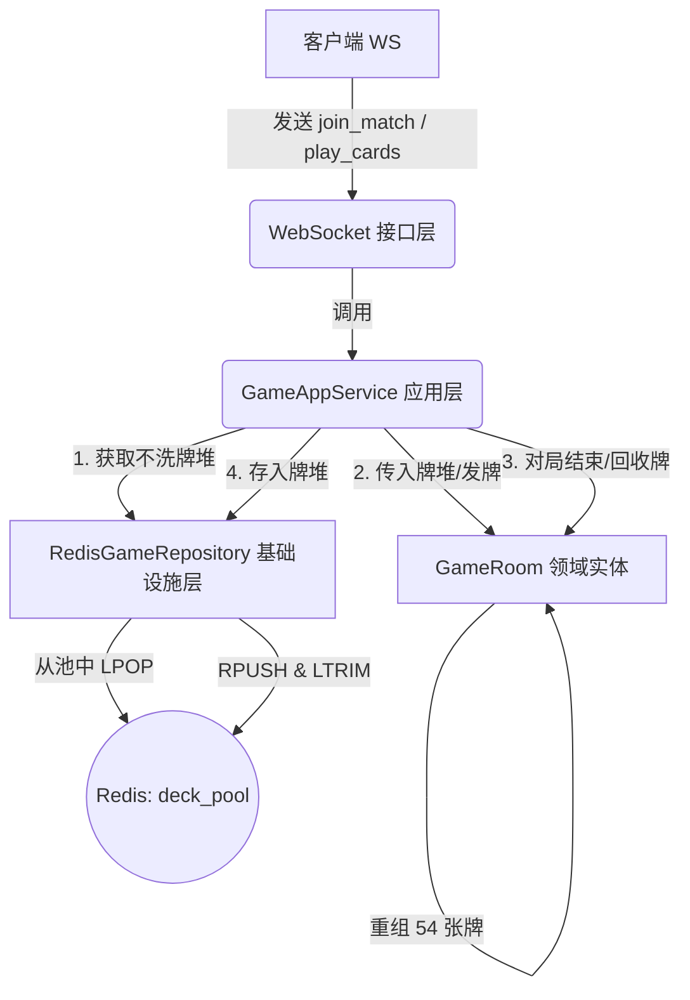

# 🃏 不洗牌功能设计规格书 (No-Shuffle Game Mode Design Spec)

本项目旨在为欢乐斗地主网络对战系统新增“不洗牌玩法”，参考腾讯欢乐斗地主的经典不洗牌模式。核心目标是通过保留上一局的出牌局部顺序，提高拿到炸弹、顺子、飞机等大牌的概率，增强对局的激烈程度和感官刺激。

---

## 📌 需求设计

不洗牌玩法的核心原则是**“不打破牌序局部相关性，一叠分发”**，包含以下主要需求点：
1. **匹配场次划分**：玩家在大厅中除了选择底分外，还可以切换“经典场”与“不洗牌场”。
2. **全局不洗牌传承**：在多人随机匹配的环境下，通过服务器全局历史废牌池来实现玩家与玩家之间的牌序流动传承，使得即使第一局匹配开局也是真实的不洗牌。
3. **安全与降级**：当全局池为空时自动降级为经典随机洗牌，并且回收牌堆时必须经过 100% 的 54 张牌无重复无缺失强健性校验，防范污染。
4. **切牌与发牌**：发牌前仅进行一次切两截拼接的“随机切牌”操作，发牌时通过直接“切片发牌”（每个玩家连续分发 17 张，最后 3 张为底牌）来保留牌序。

---

## 🧱 架构设计与模块分工

为了保持项目现有的 **DDD 领域驱动设计**，我们采用应用层与领域层完全解耦的设计，严禁将 Redis 调用注入到 Room 领域实体中。



### 1. 领域层 (Domain Layer)
*   **[MODIFY] [card.py](file:///d:/Project_2023/happy_doudizhu-欢乐斗地主/backend/app/domain/game/card.py)**：
    *   新增 `cut_cards(deck: List[int]) -> List[int]` 函数，实现只切牌不洗牌。
*   **[MODIFY] [room.py](file:///d:/Project_2023/happy_doudizhu-欢乐斗地主/backend/app/domain/game/room.py)**：
    *   新增 `play_mode: str = "classic"` 属性（可选值为 `"classic"` 或 `"no_shuffle"`）。
    *   新增 `deal_with_deck(deck: List[int])` 接口：在此接口中调用 `cut_cards`，然后按 17-17-17-3 切片分配给 `self.hands` 和 `self.bottom_cards`。
    *   新增 `recycle_cards() -> List[int]` 接口：用于在游戏结束时，收集 `self.all_played_cards` 以及三个玩家手牌中剩余的牌，重组为 54 张牌，并在返回前进行元素无重无漏校验（校验失败返回默认的 0~53 干净牌组）。

### 2. 基础设施层 (Infrastructure Layer)
*   **[MODIFY] [redis_game_repository.py](file:///d:/Project_2023/happy_doudizhu-欢乐斗地主/backend/app/infrastructure/redis_game_repository.py)**：
    *   修改 `_get_queue_key(self, base_score: int, play_mode: str = "classic")`：支持通过 `play_mode` 隔离经典与不洗牌场的 Redis 匹配列表。
    *   修改匹配相关的方法以透明支持传入 `play_mode`。
    *   新增 `pop_no_shuffle_deck() -> Optional[List[int]]`：从 Redis 队列 `game:noshuffle:deck_pool` 中 `LPOP` 弹出一叠废牌（注意做好 bytes 转换）。
    *   新增 `push_no_shuffle_deck(deck: List[int]) -> None`：将回收的牌堆 `RPUSH` 入队列，并通过 `LTRIM game:noshuffle:deck_pool -100 -1` 保留最新 100 局，以控制 Redis 内存。

### 3. 应用服务层 (Application Layer)
*   **[MODIFY] [game_app_service.py](file:///d:/Project_2023/happy_doudizhu-欢乐斗地主/backend/app/application/game/game_app_service.py)**：
    *   扩展 `join_match` 和 `fill_with_ai` 等开局编排方法，使其接收 `play_mode` 参数。
    *   在开局时，若是不洗牌模式则调用 `pop_no_shuffle_deck()`。如果捞到了废牌，则传给 `room.deal_with_deck(deck)` 开局；否则退避调用普通的 `room.deal()`。
    *   在 `play_cards()` 确定对局胜利并进行结算归档前，同步调用 `room.recycle_cards()` 并通过仓储写入不洗牌 Redis 池。

---

## 🔌 接口协议变更

### 1. 客户端匹配指令 (`join_match`)
客户端发送的消息增加 `play_mode` 字段：
```json
{
  "action": "join_match",
  "nickname": "测试玩家",
  "base_score": 10,
  "play_mode": "no_shuffle" // 可选: "classic" (默认) | "no_shuffle"
}
```

### 2. 服务端开局广播 (`game_start`)
服务端往玩家推送的开局状态中同步下发当前玩法：
```json
{
  "event": "game_start",
  "current_turn": "player_123",
  "play_mode": "no_shuffle" // 让前端能够根据模式调整UI
}
```

---

## 🎨 前端与交互适配

为了让“不洗牌玩法”与“经典玩法”有强烈的视觉对比，渲染出高倍数对决的刺激氛围，前端将进行全方位的 UI 差异化改造：

### 1. 游戏大厅 (LobbyView.vue)
*   **页签切换与主题色瞬变**：
    *   在大厅段位卡片上方，增加一个玻璃态高亮切换页签（“经典玩法” / “不洗牌玩法”）。
    *   当选择“经典玩法”时，大厅保持原生的深蓝/青色玻璃态设计。
    *   当切换到“不洗牌玩法”时，大厅的卡片背景色和边框将由青蓝色微调为**红金/紫红渐变玻璃态**，卡片右上角增加一个醒目的 **“炸弹多”/“高倍率”** 精致烫金角标，大厅顶部的文字和按钮加上相应的霓虹微光。
*   **匹配弹窗个性化**：
    *   不洗牌场匹配等待时，匹配状态弹窗（Overlay）会由原生的经典暗蓝背景切换成专属的**火焰暗红毛玻璃背景**。
    *   提示词动态更新为：`匹配场次：不洗牌 - {段位名}`，并带有特制旋转红色粒子特效。

### 2. 对局房间 (GameRoomView.vue)
*   **专属房间背景（烈火战局）**：
    *   如果对局检测到 `play_mode === 'no_shuffle'`，主容器绑定 `.no-shuffle-room` 样式类。
    *   房间背景由经典暗蓝绿色渐变，切换为专属的**深绯红与暗金交织渐变（烈火战局主题色）**，营造高倍率刺激氛围。
*   **牌桌中央印章**：
    *   牌桌中心将常驻一个带有暗金浮雕描边的 **“不洗牌模式”** 特制圆形浮雕印章。
*   **对局信息与高倍特效**：
    *   界面头部底分/倍数区域右侧常驻带有霓虹呼吸灯动效的 **“不洗牌”** 标志。
    *   当玩家在不洗牌场中打出炸弹触发翻倍时，炸弹动效的底光从普通金黄升级为更为震撼的**炽热火红色翻倍粒子特效**。
*   **Mock 模式扩展**：
    *   在 `?mock=true` 调试环境下，如果选择了不洗牌场，前端的本地 Mock 对局器在发牌时会自动模拟发配大量炸弹（例如每人自带 1~2 个炸弹手牌），以便离线测试特效渲染与叫抢加倍流程。

---

## 🧭 验证与测试计划

### 1. 自动化单元测试 (Pytest)
在 `backend/tests/` 下新增或扩展以下单元测试：
*   **算法测试**：验证 `cut_cards` 的拼接顺序正确；验证 `recycle_cards` 的 54 张牌无重无漏重组，以及出错退避生成新牌库。
*   **Redis 仓储测试**：验证 `pop_no_shuffle_deck` 和 `push_no_shuffle_deck` 能成功从 Redis 存取并成功 `LTRIM` 限制容量为 100。
*   **匹配队列测试**：验证分别有 2 名经典场玩家 and 1 名不洗牌场玩家时，他们**绝不会**匹配进同一个房间。
*   **开局与结算回放测试**：测试池子有废牌时开局、池子为空时退避发牌，以及对局结束成功回收牌。

### 2. 开发环境手动验证
1. 启动后端及 Redis、RabbitMQ 实例。
2. 前端附带 `?mock=true`，在大厅切换“不洗牌玩法”，测试界面渲染、发牌动画是否正常，叫地主及炸弹翻倍倍数是否符合预期。
3. 双网关实例启动，大厅各自选择“不洗牌场”匹配，连打两局，观察第二局玩家的起手牌是否大牌数量显著增加，并监测 Redis 键 `game:noshuffle:deck_pool` 中的数据变化。
